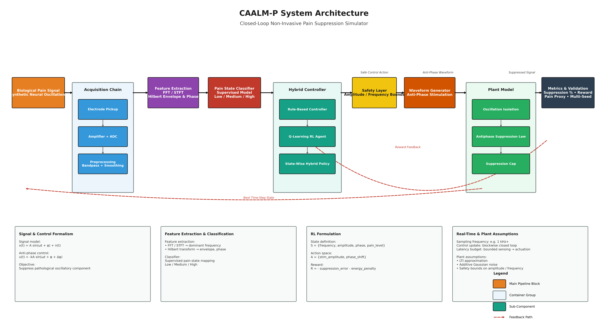
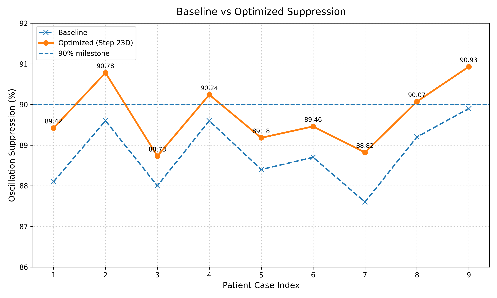

# CAALM-P

### Closed-Loop Anti-Oscillatory Adaptive Pain Suppression via Reinforcement Learning

---

##  Overview

CAALM-P is a **closed-loop, non-invasive bioelectronic stimulation framework** designed to suppress pain-related neural oscillations using adaptive control and reinforcement learning.

Unlike conventional stimulation systems that operate in open loop, CAALM-P continuously:

* Senses oscillatory neural activity
* Extracts signal features (frequency, phase, envelope)
* Adapts stimulation in real time
* Applies anti-phase modulation to suppress pathological oscillations

This project formulates pain suppression as a **signal-processing + control systems problem**, rather than a static therapy setting.

---

##  Problem Motivation

* Chronic pain affects **hundreds of millions globally**
* Pharmacological treatments:

  * Cause tolerance and dependency
  * Produce systemic side effects
* Existing stimulation systems:

  * Are largely **open-loop**
  * Do not adapt to patient-specific dynamics

-> There is a clear need for a **closed-loop, adaptive, non-invasive solution**

---

##  System Architecture

The CAALM-P pipeline consists of:

* **Signal Generation**

  * Synthetic neural oscillation model

* **Acquisition Chain**

  * Electrode pickup
  * Amplifier + ADC
  * Preprocessing (bandpass + smoothing)

* **Feature Extraction**

  * Dominant frequency (FFT)
  * Envelope & phase (Hilbert Transform)

* **Pain State Classification**

  * Discrete states: Low / Medium / High

* **Hybrid Controller**

  * Rule-based control
  * Q-learning reinforcement agent
  * State-wise hybrid policy

* **Waveform Generator**

  * Anti-phase stimulation

* **Plant Model**

  * Oscillation isolation
  * Suppression law
  * Suppression cap constraint

* **Metrics & Feedback**

  * Suppression %
  * Pain proxy
  * Reward signal

---

##  Mathematical Formulation

Signal model:
x(t) = A sin(ωt + φ) + noise

Control law (anti-phase stimulation):
u(t) = -kA sin(ωt + φ)

Reward function:
R = -|x_suppressed| - λ·energy

State space:
S = {frequency, amplitude, phase, pain_level}

Action space:
A = {stim_amplitude, phase_shift}

---

##  Simulation Results

### Key Outcomes

* Mean suppression: **~89.74%**
* Best case: **~90.93%**
* Cases ≥ 90%: **4 / 9**
* Cases ≥ 85%: **9 / 9**

### Observations

* Increasing suppression cap (0.95 → 0.99) improves performance
* Strong controller convergence achieved
* Remaining limitation lies in:

  * **plant-side alignment**
  * **antiphase matching accuracy**

---

##  Key Insight

> The primary bottleneck is no longer the controller —
> it is the **plant-side suppression formulation and phase alignment**

---

##  Hardware Feasibility

A real-world prototype would require:

* Wearable non-invasive electrodes
* Low-noise amplification
* ADC digitization
* Embedded controller (STM32-class MCU)

### Key Engineering Challenges

* Phase-aligned stimulation under noisy biosignals
* Real-time processing constraints
* Safety enforcement:

  * Current limits
  * Frequency bounds

### Important Extension

* The current implementation is **single-channel**
* Planned upgrade:

  * **Lattice-based multi-electrode array** for spatial modulation

---

##  Future Work

* Extend to **multi-electrode lattice architecture**
* Develop **spatial control policies**
* Hardware-in-the-loop validation
* Real physiological signal integration

---

##  Project Structure

CAALM-P/
│
├── src/                     # Core simulation modules
├── tools/                   # Plotting, memo, architecture scripts
├── outputs/
│   ├── figures/             # Result plots
│   └── animations/          # Demo videos
├── docs/
│   ├── architecture.png
│   ├── project_memo.pdf
│   ├── milestone_summary.md
│   └── future_work.md
│
├── main.py                  # Main simulation
├── main_animation.py        # Real-time visualization
├── requirements.txt
└── README.md

---

## ▶ How to Run

Install dependencies:
pip install -r requirements.txt

Run simulation:
python main.py

Run animation demo:
python main_animation.py

---

##  What This Project Demonstrates

* Closed-loop bioelectronic system design
* Real-time adaptive control
* Reinforcement learning in physiological systems
* Signal processing for neural modulation

---

##  Research Intent

This work is intended to be extended into:

* Real biosignal validation
* Embedded system implementation
* Closed-loop clinical prototypes

---

##  Availability

Available for full-time on-campus research
**May 2026 – August 2026**

---

##  Author

**Baibhab Pratim Datta**
Central University Jammu - ECE 
